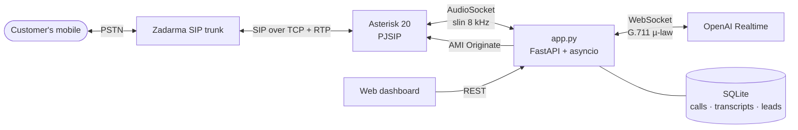

# Pioneer Voice Agent — AI outbound sales caller

An AI voice agent that **phones customers on their real mobile number**, holds a natural sales conversation in **Russian or Kazakh**, qualifies the lead, handles objections, saves a booking request and hangs up — for a family mountain resort near Almaty.

> 🇷🇺 Русская инструкция по установке: [README.ru.md](README.ru.md) · Разбор проблем: [docs/troubleshooting.md](docs/troubleshooting.md)

## Features

- **Real phone calls** over a SIP trunk (Zadarma) through a self-hosted Asterisk PBX
- **Speech-to-speech** with OpenAI Realtime — low latency, natural voice
- **Barge-in**: the caller can interrupt; the agent stops and truncates its own reply exactly where it was cut off
- **Sales script** with needs discovery, 1–2 tailored offers and objection handling ("too expensive", "too far", "I'll think about it")
- **Function calling**: catalog lookup, availability check, lead capture, callback scheduling, do-not-call list, hang-up
- **Voicemail detection**: the agent recognises an answering machine and ends the call itself
- **Safety rails for testing**: number allow-list, max call duration, admin token, do-not-call list, RTP timeout for stuck calls
- **Web dashboard**: start a call, read transcripts, see leads and callbacks
- **Text simulator** to iterate on the script without paying for phone minutes

## Architecture



**Outbound call flow**

1. The dashboard calls `POST /api/call` → the server sends an **AMI `Originate`** to Asterisk.
2. Asterisk dials the number through the Zadarma trunk. On answer the call enters the `ai-outbound` dialplan context and **`AudioSocket()`** streams the audio to the server over TCP.
3. The server converts 16-bit PCM ⇄ µ-law, paces playback in real time (20 ms frames) and bridges it to an **OpenAI Realtime** session configured with the sales prompt and tools.
4. Tool calls (`create_lead`, `schedule_callback`, `end_call`, …) are executed server-side and written to SQLite; `end_call` waits for the goodbye to finish playing, then hangs up.

## Tech stack

Python 3.12 · FastAPI · asyncio · websockets · OpenAI Realtime API · Asterisk 20 (PJSIP, AudioSocket, AMI) · Zadarma SIP · SQLite · vanilla JS dashboard · systemd · WSL2 / Ubuntu VPS

## Project structure

```
├── app.py              # FastAPI: dashboard + REST API, starts the AudioSocket server
├── telephony.py        # Asterisk side: AudioSocket bridge, real-time pacing, AMI Originate
├── agent.py            # OpenAI Realtime session: audio, barge-in, tool calls, transcripts
├── prompt.py           # Sales script (RU/KZ), edit here
├── tools.py            # Function-calling tools
├── catalog.json        # Services and prices (prices are placeholders)
├── db.py, config.py
├── static/index.html   # Dashboard
├── chat_sim.py         # Text-only simulator of the same agent
├── asterisk/           # pjsip / extensions / manager / rtp templates
├── setup_vps.sh        # One-command install on Ubuntu (VPS or WSL)
├── scripts/sip_test.py # Checks SIP registration (UDP/TCP) without Asterisk
├── voximplant/         # Alternative: fully cloud-hosted version (VoxEngine)
└── docs/troubleshooting.md
```

## Quick start

Requirements: Ubuntu 22.04/24.04 (a VPS or WSL2 on Windows), an OpenAI API key, a Zadarma account with SIP credentials and balance.

```bash
git clone https://github.com/<you>/pioneer-voice-agent.git
cd pioneer-voice-agent
cp .env.example .env && nano .env     # OPENAI_API_KEY, ZADARMA_LOGIN, ZADARMA_PASSWORD, ADMIN_TOKEN, ALLOWED_NUMBERS
sudo bash setup_vps.sh                # installs Asterisk + Python, renders configs, starts the service
asterisk -rx "pjsip show registrations"   # should say Registered
```

Open `http://<server>:5050`, enter the admin token and a number from `ALLOWED_NUMBERS`, press **Call**.

Try the script without phone calls:

```bash
python3 chat_sim.py
```

## Configuration

| Variable | Purpose |
|---|---|
| `OPENAI_API_KEY`, `REALTIME_MODEL`, `VOICE` | OpenAI Realtime session |
| `ZADARMA_LOGIN`, `ZADARMA_PASSWORD` | SIP trunk credentials |
| `ZADARMA_SERVER`, `ZADARMA_PROTO` | Nearest server (`sipal1.zadarma.com` = Almaty) and `tcp`/`udp` |
| `TEST_MODE`, `ALLOWED_NUMBERS` | Only these numbers can be called while testing |
| `MAX_CALL_SECONDS` | Hard limit per call |
| `ADMIN_TOKEN` | Protects the dashboard and API |

## Lessons learned

Real-world problems hit while bringing this up, and their fixes, are in [docs/troubleshooting.md](docs/troubleshooting.md):
home routers silently dropping SIP `REGISTER` (SIP ALG), switching to TCP and the nearest regional server,
`ufw` blocking loopback in WSL mirrored networking, provider-side "Unallocated number" rejections,
and calls that never hang up without a registration.

## Roadmap

- [ ] Self-hosted speech stack (faster-whisper → local LLM → TTS) instead of the OpenAI Realtime API
- [ ] Kazakh TTS voice
- [ ] CRM integration (Bitrix24 webhook from `create_lead`)
- [ ] Campaign dialer with retry rules and call windows
- [ ] Inbound calls on a local virtual number

## License

[MIT](LICENSE)
