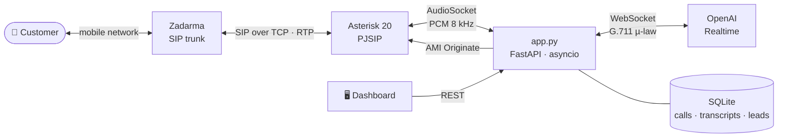

# 📞 Pioneer Voice Agent

**AI sales agent that makes real phone calls.** It dials a customer's mobile, talks naturally in **Russian or Kazakh**, finds out what they need, pitches the right offer, handles objections, saves the lead and hangs up — built for a family mountain resort near Almaty, Kazakhstan.


---

## 🎧 What a call sounds like

A real test call (the customer's side is transcribed automatically):

> **Agent:** Hello, Amanali! My name is Aigerim, I'm the virtual assistant of the Pioneer mountain resort. I'm calling about the camp for your son. Is now a good time?
> **Customer:** Yes. Well…
> **Agent:** Sure, let's go step by step. How old is your son?
> **Customer:** Eight.
> **Agent:** Got it, eight. Will he go alone, or will an adult come along too?
> **Customer:** I'd like to send a tutor with him.
> **Agent:** Understood — an 8-year-old with a tutor. Roughly which dates and how many days are you planning?

When the call lands on voicemail, the agent recognises it, says goodbye and hangs up on its own.

---

## ✨ Features

| | |
|---|---|
| ☎️ **Real phone calls** | Outbound and inbound calls over a SIP trunk (Zadarma) through a self-hosted Asterisk PBX |
| 🗣 **Speech-to-speech** | OpenAI Realtime API — low latency, natural voice, Russian and Kazakh |
| ✋ **Barge-in** | The customer can interrupt; the agent stops and trims its reply exactly where it was cut off |
| 🎯 **Sales script** | Needs discovery → 1–2 tailored offers → objection handling → close |
| 🧰 **Function calling** | Catalog lookup, availability, lead capture, callback scheduling, do-not-call list, hang-up |
| 📼 **Voicemail detection** | Ends the call by itself when it reaches an answering machine |
| 🛡 **Safe testing** | Number allow-list, max call length, admin token, do-not-call list, RTP timeout for stuck calls |
| 📊 **Dashboard** | Start calls, read transcripts, see leads and callbacks |
| 💬 **Text simulator** | Iterate on the script in the terminal without paying for phone minutes |

---

## 🏗 Architecture



**How an outbound call works**

1. The dashboard sends `POST /api/call`; the server tells Asterisk to dial via **AMI `Originate`**.
2. Asterisk calls the number through the Zadarma trunk. When the customer answers, the dialplan runs **`AudioSocket()`** and streams the call audio to the server over TCP.
3. The server converts PCM ⇄ µ-law, plays the agent's voice back in real time (20 ms frames) and bridges everything to an **OpenAI Realtime** session that holds the sales prompt and tools.
4. Tool calls (`create_lead`, `schedule_callback`, `end_call`, …) run on the server and are saved to SQLite. `end_call` waits until the goodbye finishes playing, then hangs up.

---

## 🧱 Tech stack

**Backend:** Python 3.12 · FastAPI · asyncio · websockets · SQLite
**Voice AI:** OpenAI Realtime API (speech-to-speech, function calling, server VAD)
**Telephony:** Asterisk 20 (PJSIP, AudioSocket, AMI) · Zadarma SIP
**Ops:** systemd · Ubuntu VPS or WSL2 · one-command installer
**Alternative:** fully cloud-hosted version on Voximplant (VoxEngine JS)

---

## 📁 Project structure

```
├── app.py              # FastAPI: dashboard + REST API, starts the AudioSocket server
├── telephony.py        # Asterisk side: AudioSocket bridge, real-time pacing, AMI Originate
├── agent.py            # OpenAI Realtime session: audio, barge-in, tools, transcripts
├── prompt.py           # Sales script (RU/KZ) — edit here
├── tools.py            # Function-calling tools
├── catalog.json        # Services and prices (prices are placeholders)
├── db.py · config.py
├── static/index.html   # Dashboard
├── chat_sim.py         # Text-only simulator of the same agent
├── asterisk/           # pjsip / extensions / manager / rtp templates
├── setup_vps.sh        # One-command install on Ubuntu (VPS or WSL)
├── scripts/sip_test.py # Checks SIP login/password and network without Asterisk
├── voximplant/         # Cloud-only variant (no server needed)
└── docs/troubleshooting.md
```

---

## 🚀 Quick start

**You need:** Ubuntu 22.04/24.04 (VPS or WSL2), an OpenAI API key, a Zadarma account with SIP credentials and some balance.

```bash
git clone https://github.com/JackSparrow322432/pioneer-voice-agent.git
cd pioneer-voice-agent
cp .env.example .env && nano .env        # fill in keys and SIP credentials
sudo bash setup_vps.sh                   # installs Asterisk + Python and starts the service
asterisk -rx "pjsip show registrations"  # should say: Registered
```

Open `http://<server>:5050`, enter your `ADMIN_TOKEN` and a number from `ALLOWED_NUMBERS`, press **Call** — your phone rings.

**Try the script without phone calls:**

```bash
python3 chat_sim.py
```

---

## ⚙️ Configuration

| Variable | What it does |
|---|---|
| `OPENAI_API_KEY`, `REALTIME_MODEL`, `VOICE` | OpenAI Realtime session |
| `ZADARMA_LOGIN`, `ZADARMA_PASSWORD` | SIP trunk credentials |
| `ZADARMA_SERVER`, `ZADARMA_PROTO` | Nearest server (`sipal1.zadarma.com` = Almaty) and `tcp` / `udp` |
| `TEST_MODE`, `ALLOWED_NUMBERS` | While testing, only these numbers can be called |
| `MAX_CALL_SECONDS` | Hard limit per call |
| `ADMIN_TOKEN` | Protects the dashboard and API |
| `AGENT_NAME`, `COMPANY_NAME` | Persona |

---

## 🧠 Lessons learned

Bringing this up on real networks surfaced problems that never show in a local demo. Each one is written up with symptoms and a fix in [docs/troubleshooting.md](docs/troubleshooting.md):

- Home routers (SIP ALG) silently dropping SIP `REGISTER` while letting `OPTIONS` through → switched to **TCP** and the nearest regional server
- `ufw` blocking loopback traffic under **WSL mirrored networking**, which broke AMI and AudioSocket
- A provider answering calls itself with **"Unallocated number"** instead of ringing the phone
- Calls that never hung up without a registration (no `BYE` reached Asterisk) → **RTP timeout** + registration monitoring

---

## 🗺 Roadmap

- [ ] Fully self-hosted voice stack: faster-whisper → local LLM → TTS
- [ ] Native Kazakh TTS voice
- [ ] Bitrix24 CRM integration from `create_lead`
- [ ] Campaign dialer: lead lists, call windows, retries
- [ ] Inbound line on a local virtual number

---

## 👤 Author

**Amanali Karatay** — Almaty, Kazakhstan · [GitHub](https://github.com/JackSparrow322432)

## 📄 License

[MIT](LICENSE)
